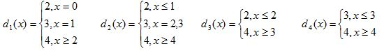

```{r setup, include=FALSE}
knitr::opts_chunk$set(echo = TRUE)
library(Matrix)
```

## STEP 1: 

Make sure you set the working directory to the folder where you save this .Rmd file qand the graphics file. 

## STEP 2: Chapter 1 Practical

A decision maker has to decide on the average value of the number of serious accidents in his new manufacturing plant.  Since there is little information available, it is assumed that the number of accidents is a random variable with a Poisson distribution, where the parameter $\lambda$  can only be 2, 3 or 4. After deliberation with his senior management, he has to decide between the following decision functions (where $x$ denotes the number of accidents in the first year of operation):


```{r, out.width='65%', fig.align='center'}
#This is how to display a graphic using Latex in R Markdown: 

```
# A: Write the Latex code below for the four decision functions shown above. Hint they are display equations.

$d_1(x)=\left\{ \begin{array}{cc}
2\textrm{,}x=0\\
3\textrm{,}x=1\\
4\textrm{,}x\ge2 
\end{array}\right.$
$d_2(x)=\left\{ \begin{array}{cc}
2\textrm{,}x\le1\\
3\textrm{,}x=2\textrm{,}3\\
4\textrm{,}x\ge4 
\end{array}\right.$
$d_3(x)=\left\{ \begin{array}{cc}
2\textrm{,}x\le2\\
4\textrm{,}x\ge3 
\end{array}\right.$
$d_4(x)=\left\{ \begin{array}{cc}
3\textrm{,}x\le3\\
4\textrm{,}x\ge4 
\end{array}\right.$

***

The associated payoff matrix (gains) is given in the matrix below. The rows are the unknown true value of $\lambda$ and the columns are the chosen value for $\lambda$ with the order kept as 2,3,4: 

```{r}
LM <- matrix(c(6,1,-1.5,-1,5.5,4,4.1,3.2,1),nrow=3,ncol=3)
LM
```


(i) Determine the risks associated with each of the decision functions, writing your code in the chunk below (or more than one chunk if you prefer)

```{r}
PM1 <- matrix(c(0,0,0,0,0,0,0,0,0),nrow=3,ncol=3)
PM2 <- matrix(c(0,0,0,0,0,0,0,0,0),nrow=3,ncol=3)
PM3 <- matrix(c(0,0,0,0,0,0),nrow=3,ncol=2)
PM4 <- matrix(c(0,0,0,0,0,0),nrow=3,ncol=2)

#d1:
PM1[1,1] <- ppois(0,2)
PM1[1,2] <- ppois(1,2)-PM1[1,1]
PM1[1,3] <- 1-PM1[1,1]-PM1[1,2]
PM1[2,1] <- ppois(0,3)
PM1[2,2] <- ppois(1,3)-PM1[2,1]
PM1[2,3] <- 1-PM1[2,1]-PM1[2,2]
PM1[3,1] <- ppois(0,4)
PM1[3,2] <- ppois(1,4)-PM1[3,1]
PM1[3,3] <- 1-PM1[3,1]-PM1[3,2]

#d2:
PM2[1,1] <- ppois(1,2)
PM2[1,2] <- ppois(2,2)-PM2[1,1]
PM2[1,3] <- 1-PM2[1,1]-PM2[1,2]
PM2[2,1] <- ppois(1,3)
PM2[2,2] <- ppois(2,3)-PM2[2,1]
PM2[2,3] <- 1-PM2[2,1]-PM2[2,2]
PM2[3,1] <- ppois(1,4)
PM2[3,2] <- ppois(2,4)-PM2[3,1]
PM2[3,3] <- 1-PM2[3,1]-PM2[3,2]

#d3:
PM3[1,1] <- ppois(2,2)
PM3[1,2] <- 1-PM3[1,1]
PM3[2,1] <- ppois(2,3)
PM3[2,2] <- 1-PM3[2,1]
PM3[3,1] <- ppois(2,4)
PM3[3,2] <- 1-PM3[3,1]

#d4:
PM4[1,1] <- ppois(3,2)
PM4[1,2] <- 1-PM4[1,1]
PM4[2,1] <- ppois(3,3)
PM4[2,2] <- 1-PM4[2,1]
PM4[3,1] <- ppois(3,4)
PM4[3,2] <- 1-PM4[3,1]

#Now, for the risk function matrix:
RM <- matrix(c(0,0,0,0,0,0,0,0,0,0,0,0),nrow=3,ncol=4)
RM[1,1] <- LM[1,1]*PM1[1,1]+LM[1,2]*PM1[1,2]+LM[1,3]*PM1[1,3]
RM[1,2] <- LM[1,1]*PM2[1,1]+LM[1,2]*PM2[1,2]+LM[1,3]*PM2[1,3]
RM[1,3] <- LM[1,1]*PM3[1,1]+LM[1,3]*PM3[1,2]
RM[1,4] <- LM[1,2]*PM4[1,1]+LM[1,3]*PM4[1,2]
RM[2,1] <- LM[2,1]*PM1[2,1]+LM[2,2]*PM1[2,2]+LM[2,3]*PM1[2,3]
RM[2,2] <- LM[2,1]*PM2[2,1]+LM[2,2]*PM2[2,2]+LM[2,3]*PM2[2,3]
RM[2,3] <- LM[2,1]*PM3[2,1]+LM[2,3]*PM3[2,2]
RM[2,4] <- LM[2,2]*PM4[2,1]+LM[2,3]*PM4[2,2]
RM[3,1] <- LM[3,1]*PM1[3,1]+LM[3,2]*PM1[3,2]+LM[3,3]*PM1[3,3]
RM[3,2] <- LM[3,1]*PM2[3,1]+LM[3,2]*PM2[3,2]+LM[3,3]*PM2[3,3]
RM[3,3] <- LM[3,1]*PM3[3,1]+LM[3,3]*PM3[3,2]
RM[3,4] <- LM[3,2]*PM4[3,1]+LM[3,3]*PM4[3,2]

RM
```

(ii) Use the minimax criterion to determine the optimal decision function, writing your code in the chunk below. Note the code must do the calculations; it should not be done manually so that if the $LM$ chanegs this will automatically change. 

```{r}
mmcriterion <- max(min(RM[,1]),min(RM[,2]),min(RM[,3]),min(RM[,4]))
mmcriterion
```


